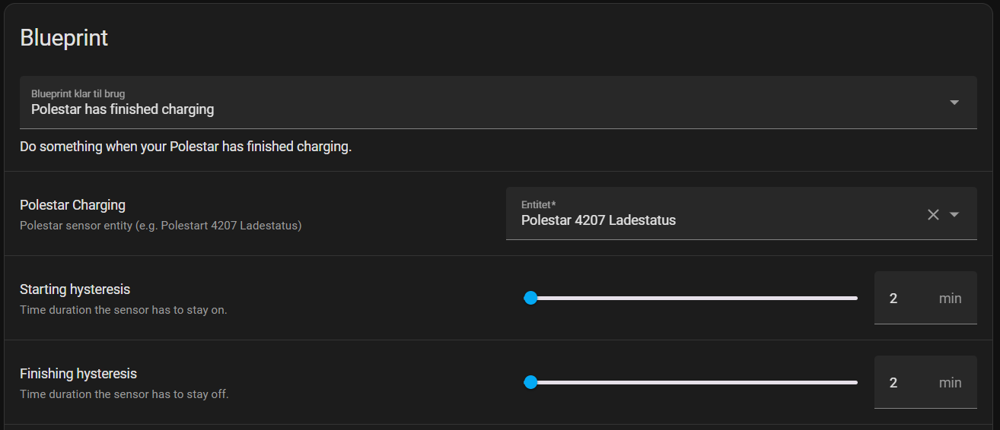
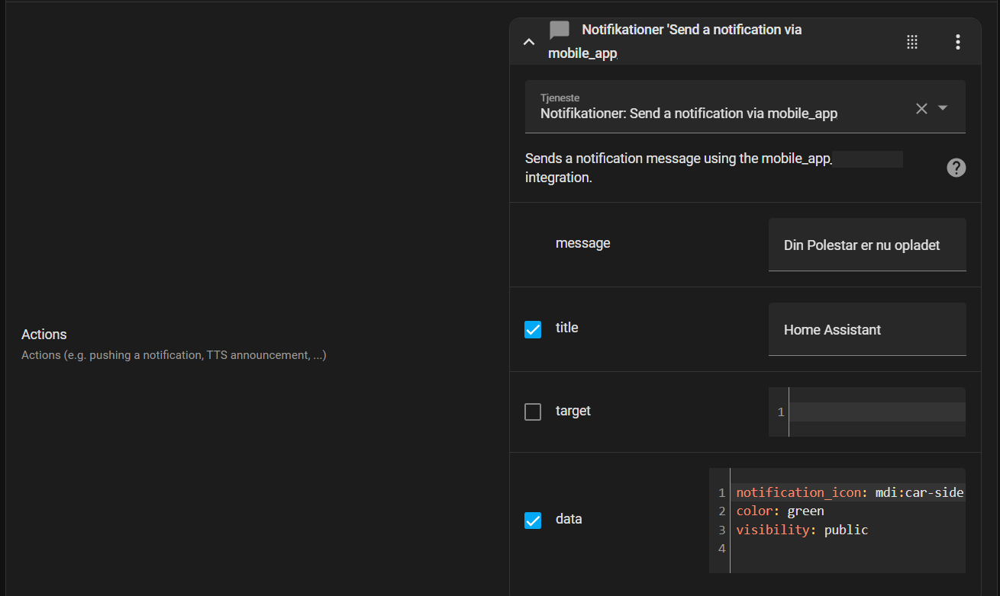

# Polestar Charging Notification
## Description
This is a Home Assistant Blueprint that notifies you when your Polestar has completed charging.



## Installation
From Home Assistant, import the blueprint by adding the following url:
https://github.com/Habengut/Polestar_Charging/blob/main/Polestar_Charging_Blueprint.yaml

## Dependencies
This Blueprint requires the [Polestar_api](https://github.com/leeyuentuen/polestar_api) from [leeyuentuen](https://github.com/leeyuentuen):


## Customization


Polestar Charging: `Select your Polestar charging status`

Starting Hysteresis: `Delay after charging cable has been plugged in`

Finishing Hysteresis: `Delay after charging has completed before action`

Actions:
`Send notification to your phone`

Title:
`Home Assistant`

Message:
`Your Polestar has finished charging`

Tick the box *"Data"* and paste the following into the data field:
```
notification_icon: mdi:car-side
color: green
visibility: public
```
## Author
Made by [Habengut](https://github.com/Habengut)

## Version History
1.0 - Initial Release

## Licensing
This project is licensed under the MIT License - see the [LICENSE.md](./LICENSE.md) file for details
